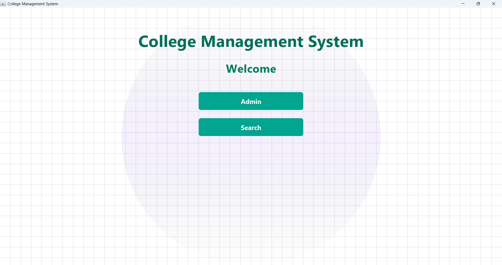

# College Management System

## Home Page

## Introduction
The College Management System is a Java-based desktop application developed to manage student records efficiently.  
It allows an administrator to perform basic operations on student data through a simple and user-friendly interface built using Java Swing.

The system focuses on making student management easy and organized for college administration.

---

## Features
- Admin login functionality
- Add student details
- Delete student records
- Update student information
- Search student records
- Interactive and easy-to-use GUI

---

## Tech Stack

### Frontend
- Java Swing
- ActionListener
- Pattern Craft Tool

### Backend
- JDBC Connection
- MySQL Database

